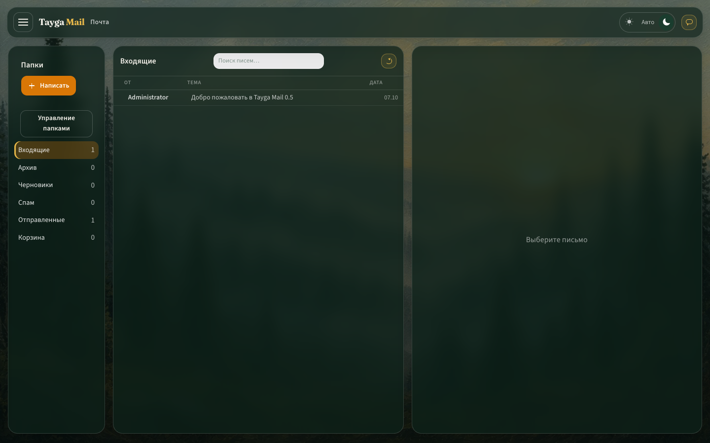
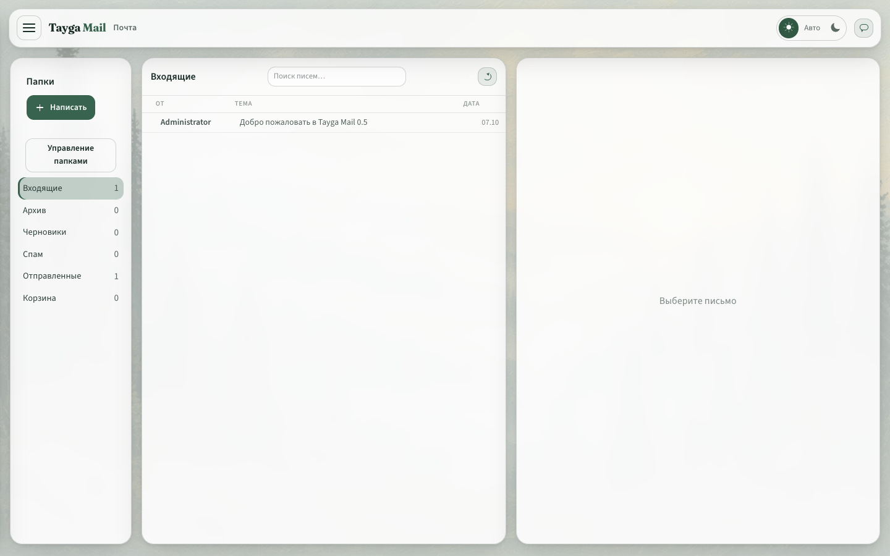
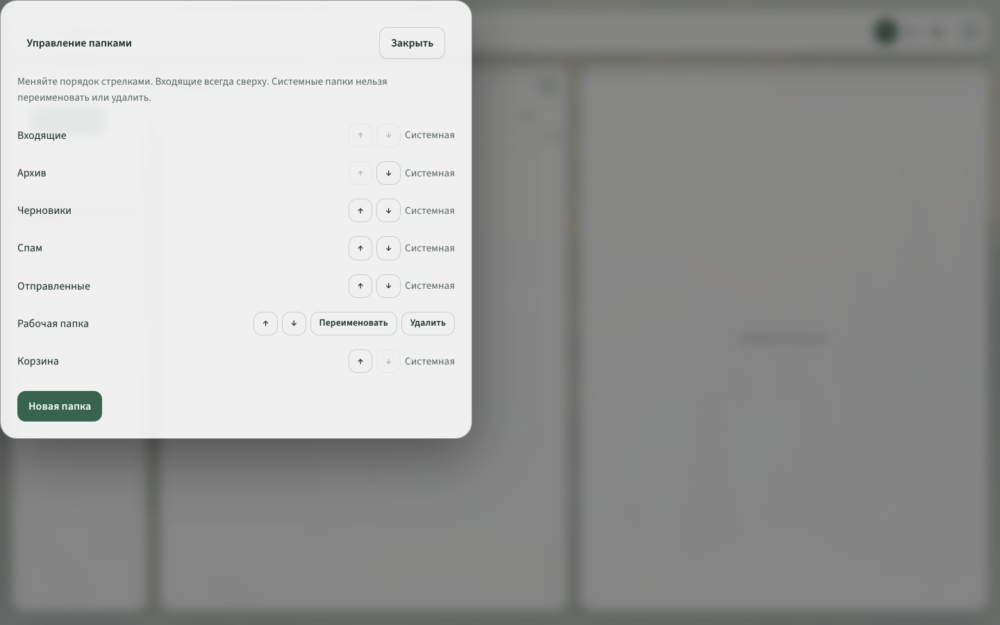
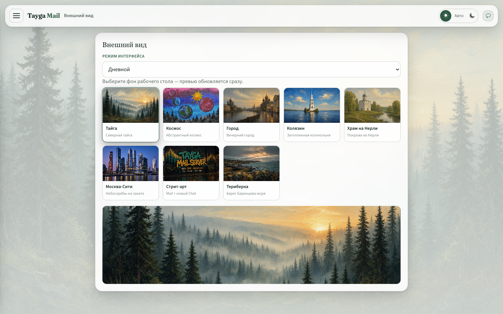
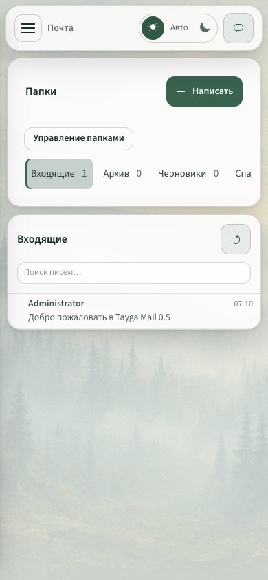

# Скриншоты Tayga Mail

Коллекция показывает интерфейс с парящими панелями, скруглёнными краями и дневным/ночным режимом.

## Почта

Ночной режим:



Дневной режим:



Управление папками — перевод системных названий, закреплённые «Входящие», порядок и пользовательские папки:



- [Управление папками на телефоне](ui-mail-folders-tayga-light-mobile.png)

## Внешний вид



## Мобильный интерфейс



- [Мобильная почта — ночной режим](ui-mail-tayga-mobile.png)
- [Мобильное меню](ui-navigation-tayga-mobile.png)
- [Написание письма — дневной режим](ui-compose-tayga-light.png)

## Настройки администратора и календарь

- [Форма SMTP — дневной режим](ui-settings-smtp-tayga-light.png)
- [Форма SMTP — ночной режим](ui-settings-smtp-tayga.png)
- [Расписание дня](ui-calendar-day-tayga-light.png)
- [Лоток приглашений](ui-calendar-invites-tayga-light.png)

## Классы обслуживания и миграция

- [Форма класса обслуживания](ui-cos-editor-tayga-light.png)
- [Форма класса обслуживания на телефоне](ui-cos-editor-tayga-light-mobile.png)
- [Выбор типа переноса](ui-migration-tayga-light.png)
- [Параметры переноса почты](ui-migration-dialog-tayga-light.png)

## Остальные экраны

Для календаря, контактов, заметок, файлов, чата и административных разделов доступны ночные `ui-*-tayga.png` и дневные `ui-*-tayga-light.png` версии. Также сохранены примеры фонов «Космос», «Москва-Сити», «Стрит-арт» и «Териберка».

## Обновление

Соберите frontend (`npm run build --prefix frontend`) и сервер, затем запустите сервер с тестовыми данными. Скрипт использует отдельную браузерную сессию и seed-аккаунт `admin@example.com` / `changeme`.

```bash
node scripts/capture-screenshots.mjs
```

По умолчанию сервер доступен на `http://127.0.0.1:18080`. Переменные `TMS_URL` и `CHROME_PATH` позволяют указать другой адрес сервера и путь к Chromium/Chrome.

Размер настольных снимков — 1440 × 900, мобильных — 390 × 844. Скрипт обновляет существующие PNG и создаёт дневные и мобильные варианты.

## Обновлённые действия

- [Свойства календаря и публичная подписка](ui-calendar-properties-tayga-light.png)
- [Свойства календаря на телефоне](ui-calendar-properties-tayga-light-mobile.png)
- [Контекстное меню файлов и ZIP папки](ui-files-context-tayga-light.png)
- [Настройки XMPP по разделам](ui-xmpp-tayga-light.png)
